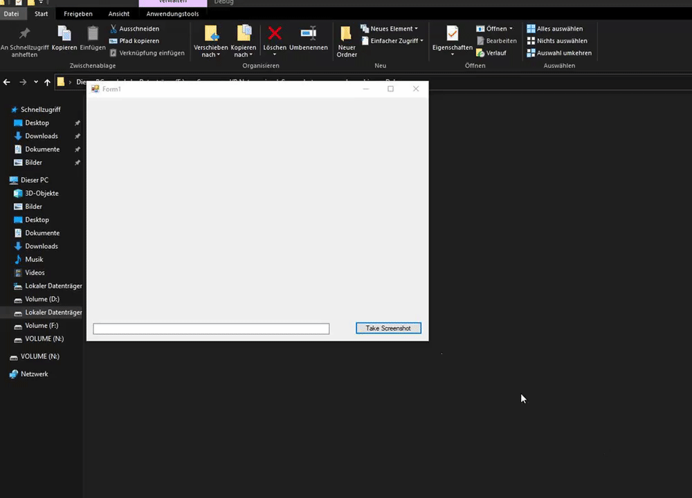

# simpleScreenshot
VB.Net library to take screenshots from user selection  
  
  
## Example


  
### Usage
See [example project](example/Form1.vb)
```
Dim sc as Bitmap = selection.capture()
```

#### Using settings
```
Dim settings as misc.settings
settings.Opacity = 0.5
Dim sc as Bitmap = selection.capture(settings)
```
##### Available settings [and default values]
- **Opacity** as *Single* [0.7]
- **Pen** as *Pen* [FromArgb(190, 100, 100, 100), 2]
- **Size** as *Point* [450, 300]
- **BackColor** as *Color* [LightGreen]
- **DashStyle** as *Drawing2D.Dashstyle*<sup>1</sup> [Dot]
- **Hint** as *String* ["The green area marks the screenshot." + vbNewLine + vbNewLine + "Press <ENTER> to capture"]
- **ResizeWidth** as *Integer* [6]
- **Format** as *misc.screenshotFormat* [screenshotFormat.Bitmap]


<sup>1</sup>Redundant, but makes it more obvious how to change the dashed border
  
### User controls
- Resize on edges<sup>1</sup>
- Move by holding LMB
- Press Enter to capture screenshot
- Press Escape to cancel

  
### Credits  
<sup>1</sup>[formResizer](https://www.vb-paradise.de/index.php/Thread/123876-Windows-Forms-FormBorderStyle-None-Resize/?postID=1075989#post1075989)